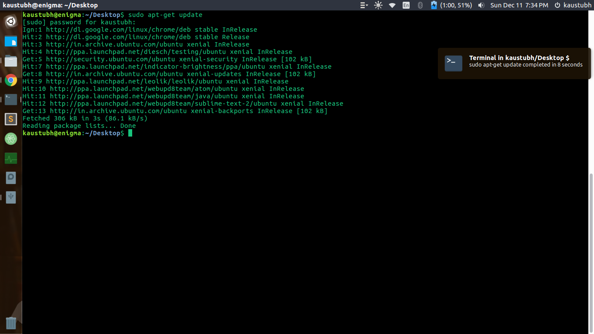

# NotiFyre

It's lit :fire:

Notify when a terminal task is done

<!---(https://drive.google.com/open?id=0B5iU6cWw36rObk9tNDEwNmhjTzA) --->

Video speed up x2 in the [video](https://drive.google.com/open?id=0B5iU6cWw36rObk9tNDEwNmhjTzA)

install **notify-send** first : `sudo apt-get install notify-osd`

Place both the .sh file and the image in your home folder.
Now you need to configure your terminal config file accordingly :`sudo subl ~/.bashrc `

Add these lines there :

<pre style="background: rgb(238, 238, 238); border: 1px solid rgb(204, 204, 204); padding: 5px 10px;">
source ~/notifyre.sh
source ~/bash-preexec.sh # as close to end as possible</pre>

These 2 lines should be as close to the end of the file as possible.

The second file is written by Ryan Caloras and the source for that could be found [here](https://github.com/rcaloras/bash-preexec).
* zsh configuration may differ(?)

# Usage

The changes made will be reflected in a new terminal.
* Alternatively, you use in the same terminal , `source ~/.bashrc` and then proceed.

Each command should work with the notifications, if it fails, a workaround could be - `notifyre sleep 2`

# Configure

<pre style="background: rgb(238, 238, 238); border: 1px solid rgb(204, 204, 204); padding: 5px 10px;">
[ $(($(date +%s) - start)) -le 0 ] || notify-send "Terminal process" "$(echo $@) completed in $(($(date +%s) - start)) seconds" -i ~/terminal.png -t 2000</pre>

The above line in notifyre.sh can be changed to your convenience.

* `-le 0`  notifies for commands which are completed in more than 0 seconds.Can change to 2, 3 seconds.

* ` "Terminal process" ` is the title of the notification.

* ` -t 2000` means the notification lasts for 2000 milliseconds.

Note:  The notifications appear in a queue, and cannot be implemented parallely. (Known bug in notify-send).

Alternatively, you could force-kill notifications when the next one is ready by adding this line at the top of `notif()` - `killall notify-osd` but the results aren't consistent. So yeah, one at a time.

# Why this
I had to reinstall Ubuntu quite a number of times thanks to how awesome Windows messed up my laptop. This script seeks to help anyone who multi-tasks, or does not constantly check their terminals. [ntfy](https://github.com/dschep/ntfy) wasn't consistent always, so made this.

Any suggestions? Make an issue about it.
